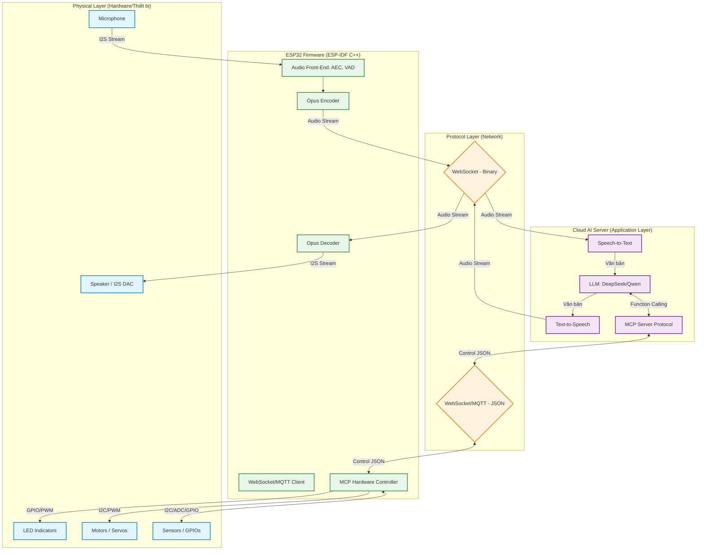
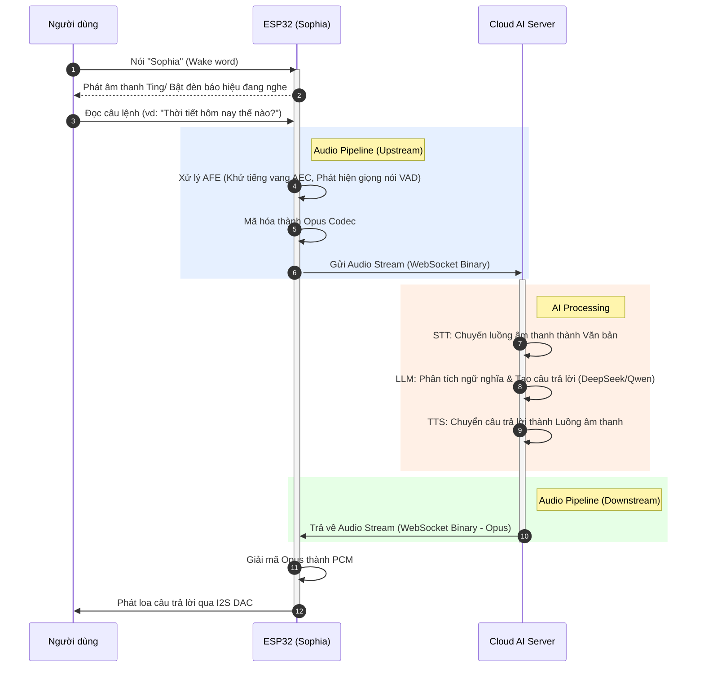
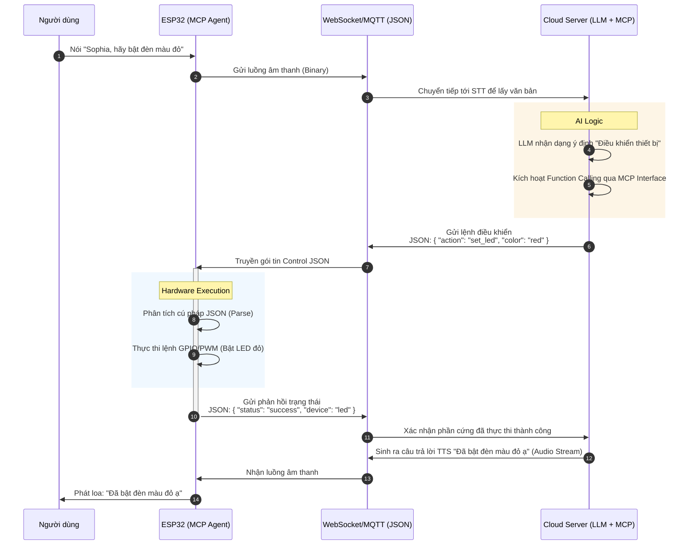

# Tài liệu Kiến trúc Hệ thống: Xiaozhi ESP32 Vietnam (Sophia)

Dự án: **Xiaozhi ESP32 Vietnam (Sophia) - AI Chatbot Robot**
Nền tảng: ESP32 (S3/C3/P4) với ESP-IDF (C++)
Phiên bản tài liệu: 1.1

---

## 1. Sơ đồ Kiến trúc Tổng thể (System Architecture Diagram)
Sơ đồ thể hiện sự phân tách rõ ràng giữa các lớp: Physical (Phần cứng), Firmware (ESP32), Network (Giao thức mạng) và Cloud (Máy chủ AI).



---

## 2. Biểu đồ Tuần tự Tương tác Giọng nói (Voice Interaction Sequence Diagram)
Mô tả toàn bộ luồng xử lý từ khi người dùng gọi "Sophia" cho đến khi nhận được phản hồi bằng giọng nói.



---

## 3. Lưu đồ Xử lý Âm thanh (Audio Pipeline Flowchart)
Chi tiết quá trình chuyển đổi và xử lý âm thanh thô thành gói tin mạng và ngược lại.

```mermaid
flowchart TD
    classDef input fill:#ffcdd2,stroke:#c62828,stroke-width:2px;
    classDef process fill:#c8e6c9,stroke:#2e7d32,stroke-width:2px;
    classDef network fill:#bbdefb,stroke:#1565c0,stroke-width:2px;

    subgraph "Upstream (Thu âm & Gửi đi)"
        I2S_In[I2S Input từ Microphone]:::input --> AFE[Audio Front-End]:::process
        AFE --> |1. Lọc nhiễu & Khử tiếng vang| AEC[Acoustic Echo Cancellation]:::process
        AEC --> |2. Phát hiện hoạt động giọng nói| VAD[Voice Activity Detection]:::process
        VAD --> |PCM Data (16kHz, 16-bit)| Encoder[Opus Encoder]:::process
        Encoder --> |Đóng gói Opus| WS_Tx[WebSocket TX Buffer - Binary]:::network
    end

    subgraph "Downstream (Nhận & Phát âm)"
        WS_Rx[WebSocket RX Buffer - Binary]:::network --> |Opus Packets| Decoder[Opus Decoder]:::process
        Decoder --> |PCM Data (16kHz/24kHz, 16-bit)| I2S_Out[I2S Output ra Speaker]:::input
    end
```

---

## 4. Quy trình Điều khiển Qua MCP (MCP Control Flow)
Ví dụ thực tế khi LLM sử dụng Model Context Protocol (MCP) để ra lệnh điều khiển phần cứng của Robot (Ví dụ: "Bật đèn").



---

## 5. Chi tiết Nguyên lý hoạt động của Cloud AI Server (AI Backend)

Phần này bổ sung kiến trúc logic và các tiến trình chạy trên Server nhằm đảm bảo khả năng xử lý luồng thời gian thực (Real-time Streaming) với độ trễ tối thiểu cho Robot Sophia.

### 5.1. Kiến trúc luồng xử lý (Server-side Data Flow)
Sơ đồ dưới đây mô tả cách Server xử lý đồng thời luồng âm thanh và logic AI theo cơ chế Bất đồng bộ (Asynchronous) để tối ưu độ trễ Time-To-First-Byte (TTFB).

```mermaid
flowchart TD
    classDef gateway fill:#e3f2fd,stroke:#1565c0,stroke-width:2px;
    classDef engine fill:#fff3e0,stroke:#e65100,stroke-width:2px;
    classDef external fill:#fce4ec,stroke:#880e4f,stroke-width:2px;

    WS_Server[WebSocket Gateway]:::gateway

    subgraph "AI Core Processing (Streaming Pipeline)"
        STT_Service[STT Engine<br/>Streaming Recognition]:::engine
        ContextMgr[Context & Session Manager]:::engine
        LLM_Service[LLM Agent<br/>DeepSeek/Qwen]:::engine
        TTS_Service[TTS Engine<br/>Streaming Synthesis]:::engine
        MCP_Manager[MCP/Function Calling<br/>Handler]:::engine
    end

    API_STT[(External STT API)]:::external
    API_LLM[(External LLM API)]:::external
    API_TTS[(External TTS API)]:::external

    %% Nhận dữ liệu
    WS_Server -->|Audio Binary (Opus)| STT_Service
    STT_Service <-->|Stream Audio/Text| API_STT
    
    %% Xử lý ngôn ngữ
    STT_Service -->|Text (User Input)| ContextMgr
    ContextMgr -->|Prompt + History + User Text| LLM_Service
    LLM_Service <-->|Prompt/Tokens| API_LLM
    
    %% Sinh giọng nói (Streaming)
    LLM_Service -->|Text Stream (Từng câu)| TTS_Service
    TTS_Service <-->|Text/Audio Stream| API_TTS
    TTS_Service -->|Audio Binary (Opus)| WS_Server
    
    %% Xử lý điều khiển (MCP)
    LLM_Service -->|Detect Intent<br/>(Function Call)| MCP_Manager
    MCP_Manager -->|Tạo lệnh JSON| WS_Server
```

### 5.2. Diễn giải nguyên lý hoạt động chi tiết

**1. WebSocket Gateway & Session Management (Cổng giao tiếp WebSocket):**
- Đóng vai trò là điểm tiếp nhận kết nối liên tục (Full-duplex) từ các bo mạch ESP32.
- Gateway thực hiện việc phân loại hai luồng dữ liệu riêng biệt: **Binary** (chứa khung âm thanh thô Opus/PCM) và **Text/JSON** (chứa thông điệp 제어, ping/pong, heartbeat, và lệnh MCP).
- Đảm nhiệm quản lý **Session ID** để nhận diện từng thiết bị vật lý (Sophia), qua đó truy xuất chính xác ngữ cảnh và lịch sử hội thoại của thiết bị từ Database.

**2. STT Engine (Speech-to-Text - Nhận dạng giọng nói):**
- Tiếp nhận luồng dữ liệu âm thanh mã hóa Opus liên tục từ thiết bị ESP32.
- Khác với API dịch thuật thông thường, hệ thống áp dụng cơ chế **Streaming Recognition (Nhận dạng luồng)**: không chờ người dùng nói dứt câu mới bắt đầu dịch. Nó tiến hành chuyển đổi âm thanh thành văn bản song song theo thời gian thực để giảm thiểu độ trễ tối đa.
- Khi tín hiệu VAD (Voice Activity Detection) từ ESP32 báo ngắt luồng (người dùng ngưng nói), STT Engine chốt lại văn bản hoàn chỉnh cuối cùng (Final Transcript) và tự động đẩy sang Context Manager.

**3. Context Manager & LLM Agent (Bộ não AI Controller):**
- Đóng gói văn bản người dùng vừa nói cùng với **System Prompt** (khai báo định danh, tính cách của Sophia là một trợ lý thân thiện) và **Lịch sử hội thoại** của Session đó.
- Chủ động nhúng danh sách các **Công cụ (Tools)** khả dụng thông qua **Model Context Protocol (MCP)** vào Prompt để LLM (DeepSeek/Qwen) hiểu được khả năng tương tác phần cứng của Robot (VD: Bật đèn, Xoay động cơ, Đọc cảm biến).
- Quá trình gọi API LLM được thực thi ở chế độ **Streaming (Server-Sent Events - SSE)**. Tức là LLM vừa "suy nghĩ" ra từng token (chữ), Server lập tức thu nhận chuỗi token đó mà không cần chờ toàn bộ đoạn hội thoại.

**4. TTS Engine (Text-to-Speech - Tổng hợp giọng nói thời gian thực):**
- Để có khả năng phản hồi như con người, luồng này sử dụng kỹ thuật **Sentence-level Streaming** (Xử lý luồng âm thanh theo từng câu).
- Cụ thể, ngay khi LLM sinh ra đủ một câu có ý nghĩa (được ngắt bởi các dấu câu như `,`, `.`, `?`, `!`), khối TTS lập tức cắt câu đó và đẩy sang API TTS để tổng hợp thành âm thanh.
- Đoạn âm thanh vừa hình thành được mã hóa tức thì thành gói Opus và đẩy thẳng xuống WebSocket để ESP32 phát ra loa. Cứ như thế, Sophia có thể vừa "phát ra tiếng" nửa câu đầu trong khi LLM vẫn đang bận "nghĩ" nửa câu sau, tạo cảm giác trơn tru không có độ trễ lớn.

**5. MCP Manager (Xử lý Context Protocol phần cứng):**
- Trong quá trình LLM phân tích ngôn ngữ tự nhiên, nếu nhận thấy câu lệnh của người dùng yêu cầu hành động vật lý (Ví dụ: "Sophia, hãy vẫy tay chào"), thay vì chỉ sinh ra văn bản, LLM sẽ tạo ra một **Function Call** ở dạng đối tượng dữ liệu.
- MCP Manager bắt luồng dữ liệu Function Call này, tiến hành phân tích cú pháp (Parse JSON) để tạo ra tệp lệnh chuẩn (VD: `{"action": "servo_wave"}`).
- Lệnh này được đẩy xuống khối WebSocket (qua nhánh Text/JSON) để gửi trả tới thiết bị ESP32 thực thi, hoàn thiện vòng lặp tương tác hai chiều (Hỏi -> Nhận dạng -> Logic AI -> Lệnh vật lý -> Thiết bị trả kết quả).
